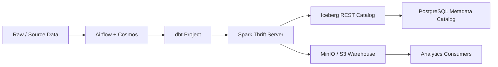
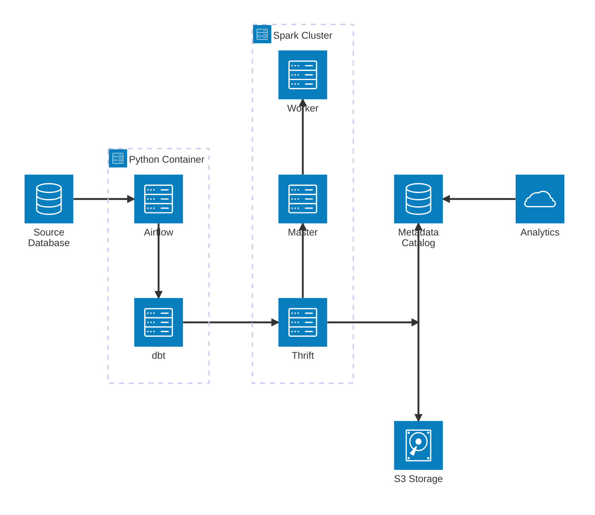

# Teratai Lakehouse Local Stack

This repository provides a local lakehouse environment for experimenting with Apache Spark, Apache Iceberg, MinIO, PostgreSQL, and dbt. The stack is designed to run with Docker Compose and is suitable for local analytics pipelines, SQL testing, and transformation workflows.

## What is included

The core platform consists of:

- PostgreSQL as the Iceberg metadata catalog
- MinIO as an S3-compatible warehouse for table data
- An Iceberg REST catalog service for Spark metadata access
- Spark master and worker nodes for distributed execution
- A Spark Thrift Server for SQL and JDBC-style access
- A dbt project under the cosmos folder with staging, intermediate, mart, and analytics models
- An example Airflow/Cosmos DAG definition for orchestration

## Architecture



## Services

- `postgres`
  - PostgreSQL 15 with `POSTGRES_DB=iceberg_catalog`
  - stores Iceberg catalog metadata
- `minio`
  - S3-compatible object store for Iceberg table files
  - exposes the MinIO API on port `9000` and the console on `9001`
- `minio-init`
  - bootstraps the `warehouse` bucket automatically
- `iceberg-rest`
  - Iceberg REST catalog service
  - connects to PostgreSQL at `jdbc:postgresql://postgres:5432/iceberg_catalog`
  - uses MinIO as the storage backend
- `spark-master`
  - Spark master node that schedules work
- `spark-worker-1` and `spark-worker-2`
  - Spark workers that execute tasks
- `spark-thrift`
  - Spark Thrift Server for SQL clients
  - depends on `spark-master` and `iceberg-rest`

## Repository layout

- `docker-compose.yml` defines the local infrastructure stack
- `cosmos/dbt_project.yml` defines the dbt project
- `cosmos/profiles.yml` configures the Spark/Thrift connection to the local stack
- `cosmos/models/` contains staging, intermediate, mart, and analytics dbt models
- `cosmos/dags/teratai_dag.py` contains an example Airflow Cosmos DAG
- `spark/` contains the Spark image build context and entrypoint scripts

## How it works

1. PostgreSQL starts and initializes the `iceberg_catalog` database.
2. MinIO starts and exposes an S3-compatible object store.
3. The Iceberg REST catalog starts after PostgreSQL and MinIO are healthy.
4. Spark master and workers register with the cluster.
5. Spark Thrift starts and connects to the Spark master and the Iceberg REST catalog.
6. The dbt project targets Spark Thrift and uses the Iceberg REST catalog together with MinIO storage.

## Local usage

Start the stack:

```bash
docker compose up --build
```

Start detached:

```bash
docker compose up --build -d
```

Check running services:

```bash
docker compose ps
```

Stop the stack:

```bash
docker compose down
```

## Optional testing container

If you want to test dbt or Cosmos from a separate container, you can attach a temporary container to the same Docker network:

```bash
docker run -d \
  --name cosmos-test \
  --restart unless-stopped \
  --network lakehouse-net \
  -v "$PWD/cosmos:/workspace" \
  -w /workspace \
  -p 123:8080 \
  python:3.12 \
  sleep infinity
```

After that, copy or mount the relevant files such as `profiles.yml` and `models/sources.yml` into the container as needed for local testing.

## Important notes

- `iceberg-rest` must be running before Spark can use the Iceberg catalog.
- The dbt profile in `cosmos/profiles.yml` uses the container hostname `spark-thrift` and the REST catalog endpoint `http://iceberg-rest:8181`.
- The Spark entrypoint scripts should be executable:
  - `chmod +x spark/spark-thrift/scripts/entrypoint.sh`
- Do not use MySQL-style SQL in PostgreSQL initialization scripts. For example, `CREATE DATABASE IF NOT EXISTS` is invalid in PostgreSQL.

## Ports

- `5432` → PostgreSQL
- `9000` → MinIO API
- `9001` → MinIO console
- `8181` → Iceberg REST catalog
- `7077` → Spark Master
- `8080` → Spark Master UI
- `8081` → Spark Worker 1 UI
- `8082` → Spark Worker 2 UI
- `10000` → Spark Thrift Server
- `4040` → Spark application UI
